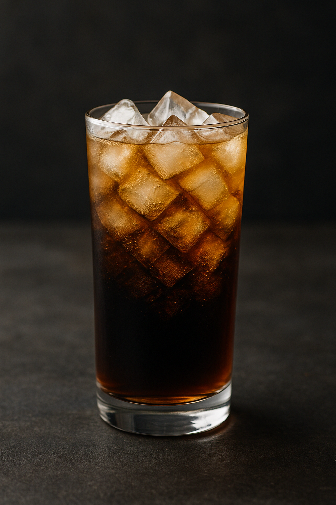

# Dry Cipher — Original Cocktail Recipe

**Author:** Ryan Sutherland  
**Created:** 2025-08-09  
**Version:** 1.0  
**License:** CC BY-NC 4.0 (Creative Commons Attribution-NonCommercial 4.0 International)  
[Full License Text](https://creativecommons.org/licenses/by-nc/4.0/)

---

## Overview

  

The **Dry Cipher** is a modern rum highball with a covert edge — a layered combination of good aged rum, dry vermouth, Coke Zero, and two-tier bitters. Balanced, aromatic, and dangerously smooth, it’s designed for repeatable precision and an unmistakable profile.

---

## Ingredients
| Ingredient        | Metric / Grams                | ml / oz                     | Notes                                |
|-------------------|-------------------------------|-----------------------------|--------------------------------------|
| Coke Zero         | 355 g                         | 355 ml / 12.0 fl oz         | 1 full can                           |
| Aged Rum          | 20–100 g                      | ~25–125 ml / 0.85–4.2 fl oz | Adjust to taste (mission parameters) |
| Dry Vermouth      | 5 g                           | 5 ml / 0.17 fl oz           | ≈ ½ cap                              |
| Orange Bitters    | 4 g                           | ~4 dashes                   | —                                    |
| Aromatic Bitters  | 1 g                           | ~1 dash                     | —                                    |
| Ice               | —                             | —                           | As needed                            |

---

## Method
1. Fill a tall glass with ice.
2. Add rum, vermouth, and both bitters.
3. Top with Coke Zero.
4. Stir gently.
5. Serve without garnish — let the flavor speak.

---

## Notes & Origin
- “Dry” references the vermouth’s crispness.  
- “Cipher” reflects the layered complexity and coded flavor profile.  
- Recipe documented and timestamped on GitHub for provenance.  
- This specification is the **official v1.0** release.

---

## Machine-Readable Formats
Import-ready files for POS, automated bartender systems, and cocktail databases are available in the [`/formats/`](formats) folder:
- **[JSON](formats/dry-cipher.json)** — For APIs and modern bar inventory systems  
- **[CSV](formats/dry-cipher.csv)** — For legacy POS systems and spreadsheet management  
- **[XML](formats/dry-cipher.xml)** — For automated bartender machines using XML-based recipes

---

## Tags
`cocktails` `recipe` `rum` `highball` `coke-zero` `vermouth` `bitters` `orange-bitters` `aromatic-bitters` `mixology` `cc-by-nc-4-0`

---

## License
This work is licensed under the Creative Commons Attribution-NonCommercial 4.0 International License.  
You may share and adapt this recipe for **non-commercial use** with attribution to the author.  
Commercial use requires explicit permission.  
[View License](https://creativecommons.org/licenses/by-nc/4.0/)
